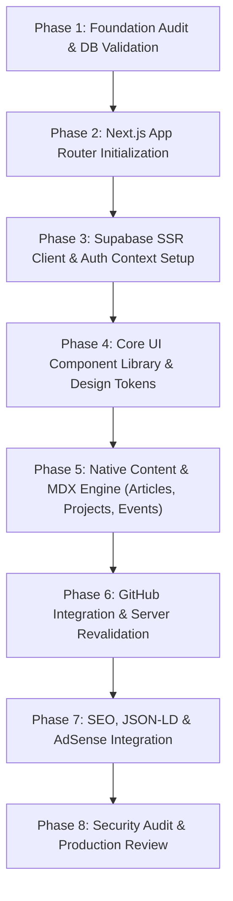

# Omnikon 2.0 — Comprehensive Implementation Audit

## 1. Overview
This implementation audit evaluates the existing Omnikon repository structure, legacy website architecture, reusable visual assets, deprecated patterns, security vulnerabilities, and migration requirements prior to Next.js App Router implementation.

---

## 2. Current Architecture vs Target Omnikon 2.0 Architecture

| Subsystem | Existing Legacy Architecture | Target Omnikon 2.0 Architecture |
| :--- | :--- | :--- |
| **Framework** | Vite static MPA (`vite.config.mjs`) | Next.js 15+ App Router (`src/app/`) |
| **Language** | Vanilla JavaScript (ES6+ DOM manipulation) | TypeScript (Strict type checks) |
| **Styling System** | Tailwind CSS + custom PostCSS | Vanilla CSS / CSS Modules with Design System Tokens |
| **Component Model** | Duplicated raw HTML files (`pages/*.html`) | React Server Components & Interactivity Client Components |
| **Database & Backend** | Direct client Supabase `blogs` table queries | Supabase PostgreSQL 21-Table Schema V2 |
| **Authorization** | Legacy Firebase compat SDK + secret string in `api/blog-insert.js` | Supabase RLS + Centralized SECURITY DEFINER RBAC |
| **GitHub Integration**| Client-side `localStorage` caching + bash script | Server-side GitHub API integration + ISR revalidation |
| **Search Engine** | None | PostgreSQL `tsvector` + GIN Indexes (`search_global` RPC) |
| **SEO & AdSense** | Script-injected metadata + auto-ads | Technical JSON-LD + `<AdSlot />` structural reservoirs |

---

## 3. Component & Asset Categorization

### A. Reusable Assets & Tokens
- **Color Identity Tokens**: Deep Obsidian background (`#050505`), Surface containers (`#0A0A0A`, `#121212`, `#18181B`), Neon Red primary accent (`#FF3131`), Gray structural borders (`#27272A`).
- **Typography Tokens**: Monospace header style (`JetBrains Mono`), body copy font (`Inter`).
- **Static Assets**: SVG Logos, favicons, branding icons located in `public/`.
- **URL Preservation Rules**: 11 legacy routes requiring 301 redirects (`/index.html` → `/`, `/blogs.html` → `/blogs`, `/projects.html` → `/projects`, `/members.html` → `/members`, `/achievements.html` → `/about`, `/ambassadors.html` → `/ambassadors`, `/docs.html` → `/docs`, `/about.html` → `/about`, `/contact.html` → `/contact`, `/privacy.html` → `/privacy`, `/terms.html` → `/terms`).

### B. Deprecated Components & Legacy Debt
- ❌ **`pages/*.html` HTML Templates**: 12 duplicated HTML files containing hardcoded headers and footers.
- ❌ **`generate-env.js`**: Script dumping public environment secrets into static JSON.
- ❌ **`update-seo.js`**: Client-side regex DOM manipulation script for meta tags.
- ❌ **`api/blog-insert.js`**: Vulnerable serverless function expecting raw secret parameters.
- ❌ **`fetch_github_data.sh`**: Static bash scraper generating local JSON snapshots.
- ❌ **External Blog Links**: Teaser links referencing external Medium/Dev.to posts without native long-form content (primary root cause of prior AdSense rejection).

---

## 4. Infrastructure & Dependency Analysis

### A. Missing Infrastructure Required for Omnikon 2.0
1. **Next.js 15+ App Router Project Setup**: `src/app/`, `src/components/`, `src/lib/supabase/`.
2. **Supabase SSR Clients**: `@supabase/ssr` server-side authentication and RLS query wrapper.
3. **MDX Content Engine**: Native `@next/mdx` or `next-mdx-remote` for rendering long-form engineering articles and project stories.
4. **AdSense Reservoirs**: `<AdSlot />` React component with 280px fixed height reservoirs preventing layout shifts (CLS).
5. **Server-Side GitHub Cache**: `github_cache` table integration with ISR revalidation.

### B. Security & Vulnerability Concerns
- **Hardcoded Secret Risks**: Legacy site used client-side authorization keys for blog submission.
- **Unvalidated External Blog Links**: Former blog aggregator led to Google AdSense *"Low Value Content"* rejection.
- **Client-Side Storage Abuse**: `localStorage` used for tracking user permissions and GitHub data.

---

## 5. Recommended Implementation Sequence

1. **Next.js App Router Setup**: Clean project structure with TypeScript and CSS Design Tokens.
2. **Supabase Client Setup**: Server-side client using `@supabase/ssr` with RLS session forwarding.
3. **Design System Components**: Terminal header, Navigation, Layouts, Buttons, Badges, Cards.
4. **Native Content System**: Native MDX rendering for Articles, Projects, Events, Updates, Recaps.
5. **GitHub Integration**: Server-side revalidation and fallback snapshots.
6. **SEO & AdSense**: Structurally compliant ad units and schema markup.
